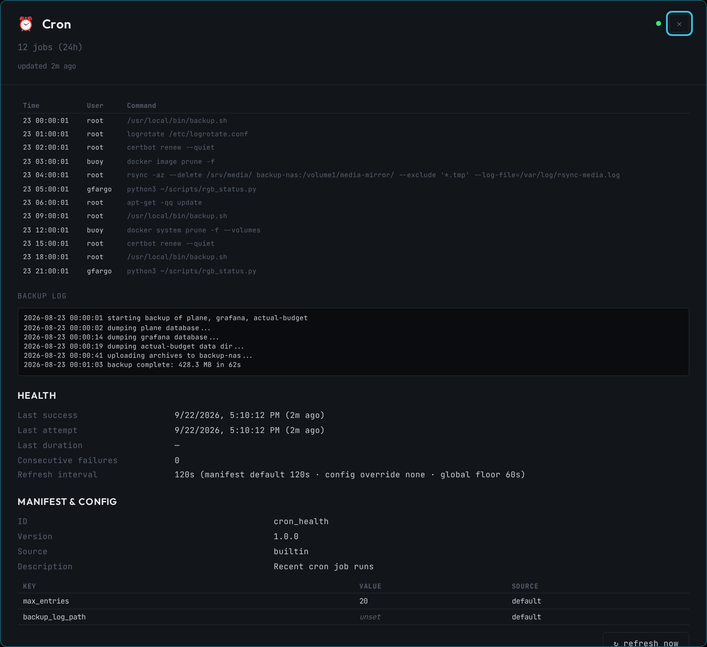

# 🔔 Buoy

A lightweight, per-node system dashboard for homelabs and small infrastructure.


---

## What it does

Deploy one container per host. Buoy auto-discovers your Docker services, shows system vitals, and connects to peer nodes for a fleet overview — your tailnet landing page.

- **System vitals** — CPU, RAM, disk, temperature, NVMe health, GPU (NVIDIA/AMD/Intel), container count, network throughput
- **Service discovery** — auto-finds running Docker containers; customize with display overrides
- **Live log streaming** — WebSocket-backed `docker logs --follow` with tail depth, follow toggle, and client-side search
- **Fleet overview** — poll peer Buoy instances for a multi-node dashboard
- **Tailscale-aware** — links auto-switch between HTTPS tailnet URLs and localhost
- **Plugin system** — extend with GitHub, UptimeKuma, Loki, Prometheus, or your own plugins
- **Beautiful by default** — dark terminal theme with sparklines, expandable detail panels
- **Zero external dependencies** — no database, no build step, just Docker

## Quick Start

```bash
# 1. Get the example config
curl -o buoy.yaml https://raw.githubusercontent.com/gfargo/buoy/main/buoy.yaml.example

# 2. Set your node name (minimum required config)
sed -i 's/my-server/your-hostname/' buoy.yaml

# 3. Run it
docker compose up -d

# 4. Open http://localhost:8090
```

## Demo Mode

Try it without any infrastructure — no Docker socket, no host access needed:

```bash
docker run --rm -p 8090:8090 ghcr.io/gfargo/buoy:latest --demo
```

Plugins are stubbed too: in demo mode a plugin's `setup()`/`collect()` are
never called (so `--demo` never makes a real outbound call), and its panel
renders sample data from `demo_data()` instead. With no `buoy.yaml`, a
curated set of built-in plugins is auto-enabled so the dashboard isn't empty;
running `--demo` against a real config that enables plugins shows exactly
those, stubbed.

## Configuration

Buoy is configured via a single `buoy.yaml` file. See [`buoy.yaml.example`](./buoy.yaml.example) for the full reference.

**Minimal config:**
```yaml
node:
  name: my-server
```

**Typical homelab:**
```yaml
node:
  name: compass
  tier: "Tier 1B"

network:
  tailnet_domain: example.ts.net
  peers:
    - name: harbor
      url: https://harbor.example.ts.net
      tier: "Tier 1A"

services:
  hidden: ["redis", "postgres"]
  overrides:
    grafana:
      name: Grafana
      icon: "📊"
      port: 3000
```

`services.hidden` entries match against the container's Docker Compose
service name (the `com.docker.compose.service` label Compose sets on every
container it manages), so `"redis"` hides a Compose-managed `plane-plane-redis-1`
container as well as a bare `redis` container run outside Compose — without
risk of also matching the project name or a compound service like
`redis-sentinel`. Entries containing `*`, `?`, or `[` are matched as glob
patterns against the full container name instead (e.g. `"plane-*-worker-*"`).

`services.overrides` keys are matched the same way: `grafana` applies to a
Compose-managed `plane-plane-grafana-1` container as well as a bare `grafana`
container run outside Compose.

**Static (non-Docker) services and bookmarks:**
```yaml
services:
  static:
    - name: NAS
      icon: "💾"
      desc: "Synology DS920+"
      url: https://nas.example.ts.net
      health_check: true       # or an explicit URL to poll instead of `url`
    - name: Router
      icon: "📡"
      url: https://192.168.1.1
      verify_ssl: false        # self-signed appliance cert
```

`services.static` entries appear alongside Docker-discovered services —
useful for a NAS, router, printer, VM, or anything else that isn't a
container on this host. Unlike Docker services, `services.hidden` and
`services.overrides` don't apply to them. `health_check: true` polls `url`
itself; a string instead polls that URL; omitting it (or `false`) renders the
entry with no status dot. Checks run in the background on
`refresh.health_check_interval` (default 60s) and never block a page load.
`verify_ssl` overrides `network.verify_ssl` per entry — handy for
self-signed certs on home appliances.

**Grouping and ordering:**
```yaml
services:
  group_label: com.docker.compose.project   # default; "" disables label-based grouping
  group_order: ["media", "monitoring"]      # unlisted groups sort alphabetically after these
  order: ["grafana", "prometheus"]          # order within a group; unlisted entries keep discovery order
  pinned: ["grafana"]                       # lifted into a leading "Pinned" group, in this order
  overrides:
    grafana:
      group: monitoring   # overrides the discovered project label
  static:
    - name: NAS
      group: storage
```

Cards on "This Node" are grouped into stacks by the `com.docker.compose.project`
label Compose sets on every container it manages — set `services.group_label`
to key off a different label instead, or `""` to disable label-based
grouping entirely. `group`/`pinned`/`order` keys match the same way
`hidden`/`overrides` do: the Compose service label, else the full container
name, else (for `services.static` entries) the static entry's `name`.
A per-entry `group` on `services.overrides`/`services.static` wins over the
discovered project label.

Environment variables override any YAML value (prefix: `BUOY_`):
```bash
BUOY_NODE_NAME=harbor
BUOY_AUTH_TOKEN=my-secret
BUOY_FEATURES_DEMO_MODE=true
```

## Install on Your Phone

Buoy is an installable PWA: open it in a mobile browser and use "Add to
Home Screen" (iOS Safari) or the install prompt (Android Chrome) to get an
app icon with a standalone window and basic offline support (cached app
shell + last-known stats). Installability requires a secure context —
HTTPS or `localhost` — so a plain `http://<lan-ip>:8090` URL won't offer
install; use your tailnet's HTTPS URL instead. Set `features.pwa: false`
to disable the manifest and service worker entirely.

Icons under `static/icons/` are committed binaries regenerated from
`static/favicon.svg` with [`sharp`](https://sharp.pixelplumbing.com/), e.g.:
```bash
node -e "
const sharp = require('sharp');
sharp('static/favicon.svg', { density: 1024 }).resize(512, 512).png().toFile('static/icons/icon-512.png');
"
```
(the maskable variant additionally scales the artwork to ~80% on a solid
`#0a0c0f` canvas so Android's circle mask doesn't clip it — see the PR that
introduced this for the exact script).

## Reverse Proxy / Sub-Path Hosting

By default buoy assumes it's served at the domain root. To serve it at a
sub-path (e.g. `https://host/buoy/`) behind a reverse proxy, set
`network.base_path` (or `BUOY_NETWORK_BASE_PATH`):

```yaml
network:
  base_path: /buoy
```

buoy then serves both the prefixed *and* unprefixed paths, so it works
whether your proxy forwards the prefix unchanged or strips it before
forwarding — `base_path` just needs to match what your browser actually
requests.

**Caddy, forwarding the prefix:**
```
handle /buoy/* {
    reverse_proxy buoy:8090
}
```

**Caddy, stripping the prefix:**
```
handle_path /buoy/* {
    reverse_proxy buoy:8090
}
```

**Traefik, stripping the prefix:**
```yaml
middlewares:
  - stripprefix:
      prefixes: ["/buoy"]
```

**nginx, forwarding the prefix** (note: no trailing slash on `proxy_pass`):
```nginx
location /buoy/ {
    proxy_pass http://buoy:8090;
}
```

In every case above, set `base_path: /buoy` — even when the proxy strips
the prefix before it reaches buoy, the *browser* still sees `/buoy/...`
URLs, so the HTML/JS/CSS buoy emits must carry that prefix too. Configure
`network.trusted_proxies` with every known proxy hop when forwarding client
identity; see `buoy.yaml.example` for the trust-chain and wildcard guidance.

## Architecture

```
Browser ←→ Starlette (async Python) ←→ Collectors (system/docker/disk/network)
                ↕                              ↕
           WebSocket                    Docker CLI / /proc / /sys
```

- **Backend:** Starlette + uvicorn (async, WebSocket-native)
- **Frontend:** Vanilla JS modules (no build step, no framework)
- **Collectors:** Python async, reading `/proc` and Docker CLI
- **Config:** Single YAML file with env var overlay
- **Plugins:** Python protocol class — drop in a `.py` file

## Docker Compose

```yaml
services:
  buoy:
    image: ghcr.io/gfargo/buoy:latest
    container_name: buoy
    restart: unless-stopped
    ports:
      - "8090:8090"
    volumes:
      - /var/run/docker.sock:/var/run/docker.sock:ro
      - ./buoy.yaml:/config/buoy.yaml:ro
      - buoy-data:/data
    privileged: true
    pid: host

volumes:
  buoy-data:
```

> **Note:** `privileged` + `pid: host` enables full system metrics (temperature, all disk mounts, NVMe SMART). If you only need container stats, you can drop `privileged` and keep just `pid: host`. See the [privilege matrix](docs/deployment/privilege-matrix.md) for the full breakdown, or the [native install](docs/deployment/native.md) to get full metrics without any container privilege flags at all.
>
> **GPU metrics:** NVIDIA needs the [NVIDIA Container Toolkit](https://docs.nvidia.com/datacenter/cloud-native/container-toolkit/latest/install-guide.html) (`--gpus all` / `runtime: nvidia`) so `nvidia-smi` is reachable inside the container; AMD/Intel read `/sys/class/drm` directly (present by default) and benefit from mounting `/dev/dri`. No GPU present or none of this configured? The GPU panel just doesn't appear — same graceful degradation as every other collector.
>
> Want the same metrics without `privileged`, or to run as a non-root user? Two ready-to-use, verified alternatives: [`docker-compose.hardened.yml`](docker-compose.hardened.yml) (full functionality, specific capabilities instead of `privileged`) and [`docker-compose.minimal.yml`](docker-compose.minimal.yml) (non-root, container-only metrics, no Docker socket).

## Other Deployment Paths

Docker Compose isn't the only option:

- [Native install (pip + systemd)](docs/deployment/native.md) — run buoy directly on the host, no container required
- [Kubernetes](docs/deployment/kubernetes.md) — plain manifests or a Helm chart, unprivileged `Deployment` or full-metrics `DaemonSet`
- [Ansible](docs/deployment/ansible.md) — a role that automates the native install
- [Privilege / metrics matrix](docs/deployment/privilege-matrix.md) — what each privilege level gains or costs you, across every deployment path

## Plugins

Buoy ships with built-in plugins (disabled by default):

| Plugin | Config key | What it shows | Config needed |
|--------|------------|----------------|---------------|
| GitHub | `github` | Notifications + open PRs | `token` |
| Gitea / Forgejo | `gitea` | Repos, open PRs, Actions queue & failures | `url`, `token` |
| UptimeKuma | `uptime_kuma` | Service health badges | `url` |
| Loki | `loki` | Recent error log entries | `url` |
| Plane | `plane` | Sprint/cycle progress | `api_key`, `url` |
| Prometheus | `prometheus_exporter` | `/metrics` endpoint — see [Grafana dashboard + rules](docs/grafana/README.md) | (none) |
| SnapRAID | `snapraid` | Parity sync age & disk health | `status_file` |
| Jellyfin | `jellyfin` | Active streams, libraries, transcoding | `url`, `api_key` |
| Plex | `plex` | Sessions, transcoding, library counts | `url`, `token` |
| *arr Stack | `arr_stack` | Queue depth, wanted/missing, indexer & system health | at least one `<service>_url` + `<service>_api_key` |
| Home Assistant | `home_assistant` | Entity/automation counts, unavailable entities, updates | `url`, `token` |
| Portainer | `portainer` | Remote container stats | `url`, `api_key`, `endpoint_id` |
| Smart Disk | `smart_disk` | SMART health for SATA + NVMe drives | (none) |
| Cert Expiry | `cert_expiry` | TLS certificate days remaining | (none) |
| Actual Budget | `actual_budget` | Monthly spend vs budget | `url`, `api_key`, `budget_sync_id` |
| Backups | `backup_status` | Backup health & freshness | (none) |
| Bans | `ban_status` | Fail2ban / CrowdSec active bans & offenders | (none) |
| Cloudflare Tunnel | `cloudflare_tunnel` | Connector health, active connections | `account_id`, `api_token` |
| Cron | `cron_health` | Recent cron job runs | (none) |
| DNS Filter | `dns_filter` | Pi-hole / AdGuard Home filtering stats | `type`, `url` |
| Downloads | `download_clients` | qBittorrent / Transmission / SABnzbd / NZBGet queue, speeds, disk | `clients` |
| Grafana / Alertmanager | `grafana_alerts` | Firing alerts by severity | `type`, `url` (+ `token` for Grafana) |
| Photos | `immich` | Immich photo library stats | `url`, `api_key` |
| Journal | `journal_errors` | Priority-error journal entries | (none) |
| Proxmox | `proxmox` | Proxmox VE node + guest status | `url`, `token_id`, `token_secret`, `node` |
| Reverse Proxy | `reverse_proxy` | Traefik / Caddy / NPM router count, 5xx rate, cert status | `type`, `url` |
| Speedtest | `speedtest` | Periodic internet speed tests with trend tracking | (none) |
| Systemd | `systemd_health` | Systemd service health checks | (none) |
| Tailscale | `tailscale` | Tailnet peer status | (none) |
| Trigger.dev | `trigger_dev` | Task run status | `url`, `api_key`, `project_ref` |
| WireGuard | `wireguard` | WireGuard tunnel peer status | (none) |
| Zigbee2MQTT | `zigbee2mqtt` | Coordinator status + per-device link quality | `host` (needs `pip install "buoy[zigbee2mqtt]"`) |
| Databases | `databases` | Connections, replication lag, slow queries, memory/evictions | `targets` (needs `pip install "buoy[databases]"`) |

**Custom plugins** are Python files dropped into the `/plugins` volume:

```python
from buoy.plugins.protocol import Plugin, PluginManifest, PanelData

class WeatherPlugin(Plugin):
    manifest = PluginManifest(id="weather", name="Weather", icon="🌤️")

    async def collect(self) -> PanelData:
        # Your logic here
        return PanelData(status="ok", summary="72°F, Sunny")

    def demo_data(self) -> PanelData:
        # Sample data for --demo — must not perform any I/O. Called instead
        # of setup()/collect() when demo mode is on; the base Plugin class
        # already provides a generic fallback, so this is optional.
        return PanelData(status="ok", summary="72°F, Sunny")
```

For a richer panel than the default key-value grid, implement `render()` and return blocks from
`buoy.plugins.panel` (`text`, `heading`, `table`, `keyvalue`, `badges`, `bar`, `sparkline`, `list_`,
`log`) — trusted, escaping frontend code turns them into HTML, so untrusted data (names, log lines,
URLs) can never inject markup. `frontend_js()` (raw JS executed via `new Function()`) is still
supported but is a deprecated escape hatch — it can't run under a strict CSP and requires escaping
every value by hand.

```python
from buoy.plugins import panel

class WeatherPlugin(Plugin):
    ...
    def render(self, data: PanelData) -> list[dict] | None:
        return [panel.keyvalue([("Temp", "72°F"), ("Condition", "Sunny")])]
```

The dashboard's detail view (`GET /api/plugins/{id}`) calls `render_detail()` instead, which
defaults to `render()`. Override it when the card's `render()` truncates a list (e.g.
`entries[:10]`, `truncate=True`) and the detail view should show the full thing — same spec, same
escaping, just more of it:

```python
class CronHealthPlugin(Plugin):
    ...
    def render(self, data: PanelData) -> list[dict] | None:
        rows = [
            [panel.cell(e["time"]), panel.cell(e["user"]), panel.cell(e["cmd"], truncate=True)]
            for e in data.detail["entries"][:10]
        ]
        return [panel.table(["Time", "User", "Command"], rows)]

    def render_detail(self, data: PanelData) -> list[dict] | None:
        rows = [
            [panel.cell(e["time"]), panel.cell(e["user"]), panel.cell(e["cmd"], wrap=True)]
            for e in data.detail["entries"]
        ]
        blocks = [panel.table(["Time", "User", "Command"], rows)]
        if data.detail.get("backup_log"):
            blocks += [panel.heading("Backup log"), panel.log(data.detail["backup_log"])]
        return blocks
```

Clicking a plugin's card opens a detail dialog showing `render_detail()`'s full panel, plus a
**Health** section (last success/attempt, collect duration, consecutive failures, effective
refresh interval) and a **Manifest & config** section (one row per `config_schema` key with its
effective value — secrets redacted — and where it came from: env, YAML, or schema default). A
**↻ refresh now** button triggers an immediate collect. Opening the dialog sets the URL hash to
`#plugin=<id>`, so it's directly linkable and shareable.



**Distributable plugins** can also be shipped as a pip-installable package. Register your `Plugin`
subclass (or a module containing one) under the `buoy.plugins` entry-point group:

```toml
# pyproject.toml of your plugin package
[project.entry-points."buoy.plugins"]
weather = "buoy_plugin_weather:WeatherPlugin"
```

Once installed alongside Buoy, it's discovered automatically at startup — same enable gate as
built-ins (`plugins.builtin.weather.enabled: true` in `buoy.yaml`). Use the `buoy plugin` CLI to
inspect what's available:

Each plugin's author-set `refresh_interval` can be overridden per instance — useful for slow
endpoints or APIs with tight rate limits — by setting `refresh_interval` (seconds) alongside
`enabled` under `plugins.builtin.<id>` in `buoy.yaml`:

```yaml
plugins:
  builtin:
    github:
      enabled: true
      refresh_interval: 600 # override the plugin's default interval
```

The global `refresh.plugins_interval` still applies as a floor on top of the override — the
effective interval is `max(refresh_interval, refresh.plugins_interval)`. This only applies to
built-in and entry-point plugins (both gate on `plugins.builtin.<id>`); plugins loaded from the
`/plugins` directory have no config entry and can't be overridden.

```bash
buoy plugin list                 # every discoverable plugin: source, id, name, version, enabled
buoy plugin info weather         # full manifest for one plugin
buoy plugin install buoy-plugin-weather   # pip install + report newly-registered plugin(s)
```

## Development

```bash
# Clone and install
git clone https://github.com/gfargo/buoy.git
cd buoy
pip install -e ".[dev]"

# Run locally (demo mode — works on macOS/Linux without Docker)
python -m buoy --demo

# Run tests
pytest

# Lint
ruff check src/ tests/
```

## Documentation

- [Configuration Reference](https://github.com/gfargo/buoy/wiki/Configuration) — full YAML config guide
- [Plugin Development](https://github.com/gfargo/buoy/wiki/Plugins) — create custom plugins
- [Native Install](docs/deployment/native.md) — pip + systemd, no Docker required
- [Kubernetes](docs/deployment/kubernetes.md) — plain manifests and a Helm chart
- [Ansible](docs/deployment/ansible.md) — automated native install
- [Privilege / Metrics Matrix](docs/deployment/privilege-matrix.md) — what each privilege level gains or costs
- [Grafana Dashboard + Rules](docs/grafana/README.md) — dashboard JSON and Prometheus recording/alert rules for the exporter
- [Changelog](CHANGELOG.md) — release history
- [Contributing](CONTRIBUTING.md) — dev setup, PR process

## License

MIT — see [LICENSE](./LICENSE).
